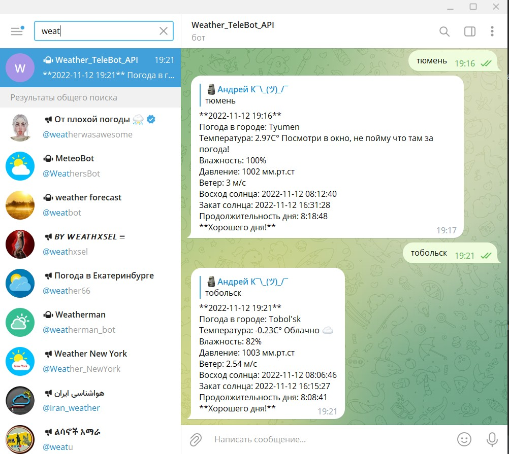

# Знакомство с языком Python (семинары)
# Урок 10. Возможна ли жизнь без PIP? Продолжение

# DZ 10. Задача:
   1. Прикрутить бота к задачам с предыдущего семинара(доделать Telebot_weather)
   2. Добавить команды с работой api Прикрепить ссылку на репозиторий с ботом.

## Создаем Телеграмм Бот Погода.

## Импортируем модули aiogram и telebot.
## Получаем и прописываем API_keys бота и openweather:
    - open_weather_token = "openwether_token"
    - tg_bot_token = "your_bot_token"
### Создаем модуль общения с ботом.
## Запускаем бот.

## Находим бота в Телеграм. Запускаем /start.
## Бот приветствует "Привет! Напиши мне название города и я пришлю сводку погоды!".
## Вводим название города.
## Бот по названию города берет данные по погоде на openweather и возвращает сводку.

# Спасибо за внимание! 
